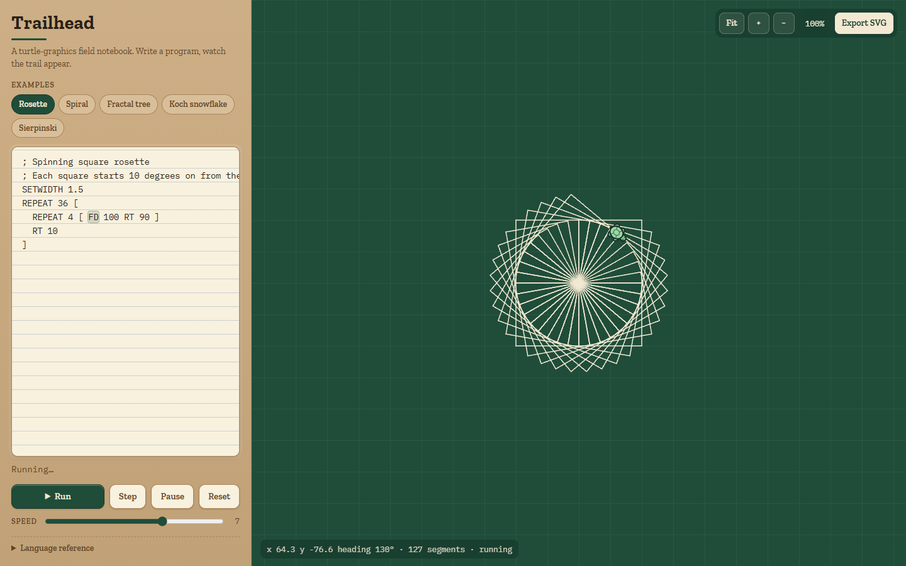

# Trailhead

A turtle-graphics language with procedures, `REPEAT` loops, variables, and
arithmetic, interpreted step by step onto a canvas with an animated turtle and
a trail you can export as SVG.



Type

```logo
REPEAT 36 [ REPEAT 4 [ FD 100 RT 90 ] RT 10 ]
```

watch the turtle draw a spinning square rosette line by line — the statement
being executed is highlighted in the editor as it runs — then hit **Export
SVG** and get a clean vector file of exactly what was drawn.

## Features

- **A small Logo dialect.** `FD BK RT LT PU PD HOME CLEAR SETXY SETHEADING
  SETCOLOR SETWIDTH`, `REPEAT n [ ... ]`, `IF cond [ ... ]`, `TO name :a :b
  ... END`, `MAKE "x expr`, `STOP`, and `;` comments. Words are
  case-insensitive; common aliases (`FORWARD`, `PENUP`, `CS`, ...) work too.
- **Expressions** with `+ - * /`, parentheses, unary minus, comparisons
  (`< > = <= >= <>`), `:variables`, and `RANDOM SIN COS SQRT ROUND REPCOUNT`.
  Unary vs. binary minus follows Logo's spacing rule, so `SETXY -150 -87` and
  `FD 10 - 5` both mean what they look like.
- **Procedures with parameters and recursion**, dynamically scoped like Logo,
  callable before they are defined, depth-limited with a clear error that
  points at the offending call.
- **Animated execution** with a speed slider from a leisurely glide to
  thousands of steps per frame. The turtle rotates and glides between
  positions and the current segment grows as it is drawn. Step, Pause, Resume.
- **One segment list, two renderers.** Every pen-down move appends a styled
  segment; the canvas paints from it (incrementally, via an offscreen cache)
  and the SVG exporter serialises it as `<path>` elements grouped by colour
  and width.
- **Errors underline the offending token** in the editor (a mirrored `<pre>`
  behind the textarea) and report `line:column` in the message.
- **Pan and zoom** with drag, wheel, pinch, or keyboard (arrows, `+`/`-`, `F`
  to fit, `0` to reset); **Fit** eases the view to frame the drawing; a
  follow-cam gently pans when the turtle wanders off-screen.
- **Example gallery:** rosette, spiral, fractal tree, Koch snowflake,
  Sierpinski triangle.

## How it works

The pipeline is three small, DOM-free modules in `src/lang/`, each tested with
vitest, plus a thin UI layer.

```
source text ──scan──▶ tokens ──parse──▶ AST ──interpret (generator)──▶ steps
"FD :n * 2"          word FD            Command{FD,           yield {type:'move',
                     variable N          [Binary(*,             from, to, segment}
                     op *                  Var(N), Num(2))]}
                     number 2
```

**Scanner and parser.** The scanner turns source into tokens (`word`,
`number`, `variable`, `quoted`, `op`, brackets) that each carry a `line:col`
and character offsets, which is what lets the editor underline exactly the
right characters later. The parser is recursive descent. A pre-pass collects
`TO name :a :b` signatures so the arity of every call site is known even before
its definition appears; statements then parse their fixed number of argument
expressions (`FD` takes one, `SETXY` two, a user procedure as many as it
declared). Expressions use the usual precedence ladder — comparison, additive,
multiplicative, unary, primary — and built-in functions bind tightly like unary
operators, so `SIN :a * 2` is `(SIN :a) * 2`.

**Interpreter.** Execution is a JavaScript generator. `REPEAT`, `IF`, and
procedure calls are all `yield*` delegations, and every turtle-changing
command yields a `Step` describing the transition (`from`/`to` turtle states
and, for a pen-down move, the new segment). The animation loop pulls one step
and eases through it over a duration derived from the speed slider — or pulls
thousands per frame within a time budget at maximum speed — while the turtle
state stays paused inside the generator between pulls. Variables live in an
environment chain: each procedure call pushes a frame holding its parameters
and pointing at the caller's frame (dynamic scope), `MAKE` assigns to the
nearest frame that already has the name or else creates a global, and a depth
counter turns runaway recursion into a friendly error instead of a stack
overflow. `STOP` is a control-flow signal caught at the procedure boundary.

**Trail and SVG.** The turtle is `{x, y, heading, pen, color, width}`; heading
0 points up and `y` grows downward like the canvas, with the four compass
directions computed exactly so squares close perfectly. Every pen-down move
appends `{x1, y1, x2, y2, color, width}` to a segment list that is the single
source of truth. The canvas caches committed segments on an offscreen bitmap
and only strokes new ones each frame; the exporter walks the same list,
merging runs that share a colour and width into one `<path>` whose `d`
continues with `L` while segments chain end-to-start and starts a new `M`
otherwise.

## Run it

```sh
npm install
npm run dev       # Vite dev server
npm run build     # type-check + production build into dist/
npm test          # vitest: scanner, parser, interpreter, SVG, gallery
```

## Tech

Vite 8 + TypeScript (vanilla, no framework), Canvas 2D, vitest, and
`@fontsource` for Zilla Slab and IBM Plex Mono. No runtime dependencies.

## License

MIT — see [LICENSE](LICENSE).
